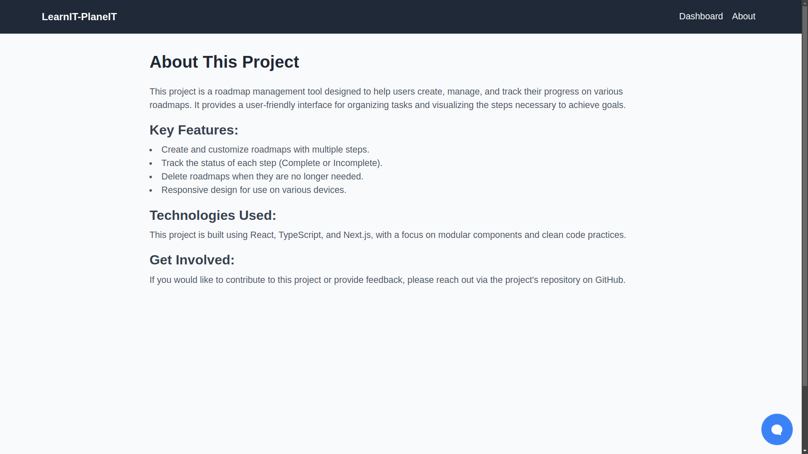

# LearnIT-PlaneIT

This is a [Next.js](https://nextjs.org) project bootstrapped with [`create-next-app`](https://nextjs.org/docs/app/api-reference/cli/create-next-app).

<div style="display: grid; grid-template-columns: repeat(2, 1fr); gap: 20px;">
  
  
  
  
  
  
</div>
## Getting Started


### Prerequisites

Make sure you have [Node.js](https://nodejs.org) installed on your machine.

### Installation

1. Clone the repository:
   ```bash
   git clone <your-repo-url>
   cd planit-learnit
   ```

2. Install the dependencies:
   ```bash
   npm install
   # or
   yarn install
   # or
   pnpm install
   # or
   bun install
   ```

### Running the Development Server

Run the development server:
```bash
npm run dev
# or
yarn dev
# or
pnpm dev
# or
bun dev
```

Open [http://localhost:3000](http://localhost:3000) with your browser to see the result.

### Environment Variables

To use the GROQ API, you'll need to set the `AI_API` environment variable. 

1.  Add your API key in local  environment variables:
   ```bash
   export AI_API=your_api_key_here
   ```

### Starting the Application

You can start editing the page by modifying `app/page.tsx`. The page auto-updates as you edit the file.

This project uses [`next/font`](https://nextjs.org/docs/app/building-your-application/optimizing/fonts) to automatically optimize and load [Geist](https://vercel.com/font), a new font family for Vercel.

## Learn More

To learn more about Next.js, take a look at the following resources:

- [Next.js Documentation](https://nextjs.org/docs) - learn about Next.js features and API.
- [Learn Next.js](https://nextjs.org/learn) - an interactive Next.js tutorial.


## Managing Dependencies

To add new dependencies, you can use:
```bash
npm install <package-name>
# or
yarn add <package-name>
# or
pnpm add <package-name>
```

To update dependencies, you can run:
```bash
npm update
# or
yarn upgrade
# or
pnpm update
```

## Contributing

If you'd like to contribute to this project, feel free to fork the repository and submit a pull request with your changes.

---

## Happy coding!
